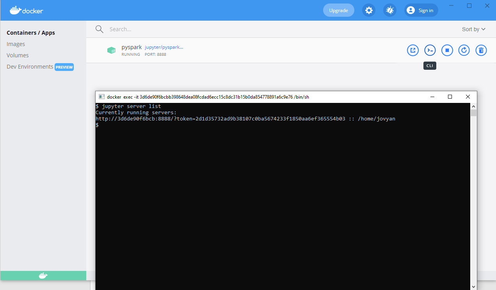

# Hands-on session:  Big Data Analytics and Stream Processing on Apache Spark

During this hands-on session you will learn using Apache Spark for processing both the unstructured and structured Big Data. To be more precise, you will learn:

1. How to use Spark’s RDD API to perform processing of a huge log file and
1. How to use Spark’s DataFrame API to perform analytics of a huge CSV file. 

You will use Python programming language and corresponding PySpark RDD and DataFrame APIs to perform the required tasks. You will learn how to start a Spark job locally on a single machine and in an actual Spark cluster. 
# Prerequisites
In order to successfully finish this hands-on session the following software is required:

- OpenSSH client 

OpenSSH client comes installed with most of the Linux distributions, and with the MacOS. For Windows 10, follow [these instructions](https://docs.microsoft.com/en-us/windows-server/administration/openssh/openssh_install_firstuse) and install only the client.

- Docker

Follow [these instructions](https://docs.docker.com/get-docker/) to install Docker application on your machine. Please note, that Windows 10 requirements differ depending on your version (i.e. Home, Pro, Enterprise or Education).
# Setup Development Environment
To write your application and test it locally before running on an actual Spark cluster you will use JupyterLab, a web-based interactive development environment for Jupyter notebooks, code, and data. Install a PySpark Docker image which will run your own instance of JupyterLab as follows:

1. Run the following command from your terminal: `docker run -p 8888:8888 -e JUPYTER_ENABLE_LAB=yes --name pyspark jupyter/pyspark-notebook`
1. After the installation finishes it will show you the address at which running instance of JupyterLab is listening. The address usually starts with <http://localhost:8888/?token=> and finishes with a required hexadecimal token. 
1. (optionally) If you do not know the required token, you can find it by running the command jupyter server list within a terminal of the running Docker instance, as shown in the following Figure. You can start the terminal by clicking on the button  in the upper right corner of the Docker application.


*Figure 1 - Finding JupyterLab token*

# Check Development Environment
To check that the development environment is correctly set up, start a new notebook by clicking **File -> New -> Notebook** in the JuypterLab. Then paste the following code:
```python
from pyspark.sql import SparkSession

session = SparkSession.builder.getOrCreate()

context = session.sparkContext

file = "/home/jovyan/.jupyter/jupyter_notebook_config.py"

data = context.textFile(file).cache()

numAs = data.filter(lambda s: 'a' in s).count()

numBs = data.filter(lambda s: 'b' in s).count()

print("Lines with a: %i, lines with b: %i" % (numAs, numBs))
```

If you have problems with copy-pasting the code from above, you can download it from the following link: <https://gitlab.tel.fer.hr/environment_check.py>.

Finally, select the cell where you pasted the code and click **Run -> Run Selected Cells** (or a grey play button  above the cell) in the JupyterLab. If everything works, the result would be as follows:

```
Lines with a: 917, lines with b: 406
```
# Download Datasets
Open a terminal of the Docker instance terminal by clicking **File -> New -> Terminal** in the JupyterLab. Run the following two commands which will download the required datasets:

```
wget https://gitlab.tel.fer.hr/Thunderbird-100k.csv

wget https://gitlab.tel.fer.hr/sorted_data-100k.csv
```

`Thunderbird-100k.csv` is a tiny portion of an open dataset of logs collected from a Thunderbird supercomputer system at Sandia National Labs (SNL) in Albuquerque, with 9,024 processors and 27,072GB memory. The log contains alert and non-alert messages identified by alert category tags. In the first column of the log, "-" indicates non-alert messages while others are alert messages. The label information is amenable to alert detection and prediction research.

`sorted_data-100k.csv` is a tiny portion of the dataset for the 2015 Grand Challenge, which is based on a data set released under the FOIL (The Freedom of Information Law) and made public by Chris Whong (<http://chriswhong.com/open-data/foil_nyc_taxi/>). This dataset consists of reports of taxi trips including starting point, drop-off point, corresponding timestamps, and information related to the payment. The columns within this dataset are listed below:

|medallion|an md5sum of the identifier of the taxi - vehicle bound|
| - | - |
|hack\_license|an md5sum of the identifier for the taxi license|
|pickup\_datetime|time when the passenger(s) were picked up|
|dropoff\_datetime|time when the passenger(s) were dropped off|
|trip\_time\_in\_secs|duration of the trip|
|trip\_distance|trip distance in miles|
|pickup\_longitude|longitude coordinate of the pickup location|
|pickup\_latitude|latitude coordinate of the pickup location|
|dropoff\_longitude|longitude coordinate of the drop-off location|
|dropoff\_latitude|latitude coordinate of the drop-off location|
|payment\_type|the payment method - credit card or cash|
|fare\_amount|fare amount in dollars|
|surcharge|surcharge in dollars|
|mta\_tax|tax in dollars|
|tip\_amount|tip in dollars|
|tolls\_amount|bridge and tunnel tolls in dollars|
|total\_amount|total paid amount in dollars|

# Task1: Processing of a log file locally
In this task you will use the PySpark’s RDD API to process file `Thunderbird-100k.csv`, which is a sequence of messages:
```
- 1131523501 2005.11.09 aadmin1 Nov 10 00:05:01 src@aadmin1 in.tftpd[14620]: tftp: client does not accept options

- 1131524071 2005.11.09 tbird-admin1 Nov 10 00:14:31 local@tbird-admin1 postfix/postdrop[10896]: warning: unable to look up public/pickup: No such file or directory

- 1131524073 2005.11.09 tbird-admin1 Nov 10 00:14:33 local@tbird-admin1 postfix/postdrop[10900]: warning: unable to look up public/pickup: No such file or directory
```
The log contains both alert and non-alert messages, where "-" at the beginning indicates a non-alert message. Each message also has a timestamp followed by the date. 

There are two subtasks that you should solve:

1. count number of alert and non-alert messages by the day of the week and 
1. find top-50 words that appear in the explanation part of messages (followed by first ":" after the time of a message which has two ":") for each year.
# Task2: Processing of a log file locally
In this task you will use PySpark’s DataFrame API to analyze taxi trip data in file `sorted_data-100k.csv`. There are two subtasks that you should solve:

1. For each year (according to `dropoff_datetime`), sort taxi drivers (identified by `hack_license`) by the average `tip_amount` divided by the `trip_time_in_secs`. Print top-20 such drivers for each year.
1. Prepare a Spark DataFrame containing information about taxi rides to [perform k-means clustering](https://spark.apache.org/docs/latest/ml-clustering.html#k-means) of taxi drivers (identified by `hack_license`). As features, use the following columns divided by the `total_amount`: 

|fare\_amount|
|surcharge|
|mta\_tax|
|tip\_amount|
|tolls\_amount|

Build your model, train it, and evaluate against the test dataset. 
# Task3: Running Spark in the cluster
The previous two task were running locally on a single machine. In this task we will run them in an actual Spark cluster. 

First, connect yourself to the Spark gateway machine by running the following command from your terminal:

```
ssh radionica@ssds-cm.cro-ngi.hr
```

The password will be given during the live hands-on session. Then, create and enter your own directory on the Spark gateway machine by running the following commands:
```
mkdir name_surname 

cd name_surname 
```
After that, initialize environment variables by running the following command:
```
source ../python_setup.sh
```
Open the nano editor by running the following command:
```
nano name_of_program.py 
```
Paste your code from the first or second tasks and change paths to dataset files from `/home/jovyan/Thunderbird-100k.csv` and `/home/jovyan/sorted_data-100k.csv` to HDFS locations `/user/radionica/Thunderbird-100k.csv` and `/user/radionica/sorted_data-100k.csv`.  When you are finished press `CTRL+x`, then press `y` and finally press `Enter`. Run your program with the following command:
```
spark-submit --master yarn name_of_program.py
```
Shuting Down the Docker Application

You can shut down the Docker application by clicking on the button  in the upper right corner of the Docker application, shown in Figure 1.